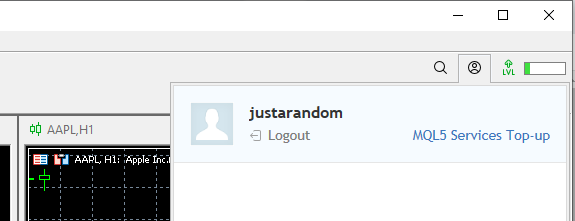
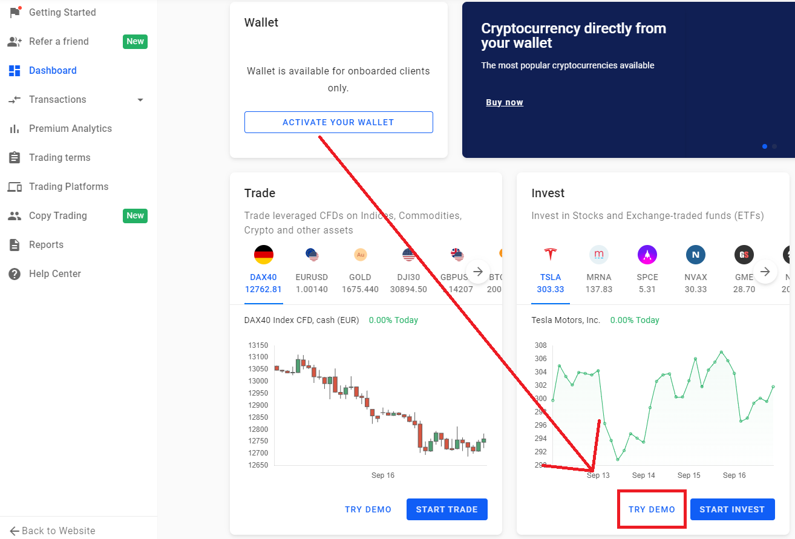

# arl22-rl-stock-trading

## Installation

### *Step 1: Install Poetry*
Use poetry as the package manager. Install it using e.g.:

```bash
pip install poetry
```

### *Step 2: Install dependencies with poetry*
The install command reads the pyproject.toml file from the current project, resolves the dependencies, and installs them.

```bash
poetry install
```
Optinally, build the project: 
```bash
poetry build
```


### *Step 3: Getting the data*
To get the data for training and testing the agent, there are two possible ways. The first method is very simple and fast but it only allows one to train and test on the AAPL dataset. The second method requires more setup to fetch the data yourself, but it allows to use different kind of data and symbols.
#### __1. Example data__
The simplest way to test the project is to download the example data from the google drive:
- [train](https://drive.google.com/file/d/1RSqUMMQNKMABYMBOX7xVJERLPZDmfYen/view?usp=sharing): The traings dataset normalized
- [test](https://drive.google.com/file/d/1aKp1tIod9vNNJkMUAxp5OSjr482dgLV6/view?usp=sharing): The testing dataset normalized
- [AAPL](https://drive.google.com/file/d/1aueBZKLYczKR9ZSSSzE0ZQHif4ijJfMd/view?usp=sharing): The original dataset
- [scalars](https://drive.google.com/file/d/1BpxnkfyELDtNlUx0kXU1pCcIQAvP56_m/view?usp=sharing): The scalers the training dataset was normalized with

The important files here are the train.csv and the test.csv, the original dataset and the scalars are not needed to start an experiment. Move test.csv and train.csv into /experiments/data/minmax or an arbitrary folder, but than the path for test and train in the .yaml  files have to be changed accordingly. 
#### __2. Fetch data yourself__

1. Install and run MetaTrader5: 
	- To install `Metatrader5`, install it from [here](https://www.metatrader5.com/). In order to fetch data please make sure your `MetaTrader5` Terminal is running and has a registered and activated
	account with your broker.
	If everything worked out clicking on the top right user icon should show your user logged in like this: 

		


2. Log in or register at Admiral Markets
	- The package was tested with an [Admiral Markets](https://admiralmarkets.com/) Investment Demo Account (_Sign up with
	Admirals, then go to the **Dashboard** and **ADD ACCOUNT** for the **Invest** option_)

		

3. Register for Finnhub and generate an API-Key
	- You will also need an account for the [Finnhub](https://finnhub.io/) API.
	Add the finnhub API key to the .env file in /experiments/.env

After all those steps are done go to the root directory of the project execute the script:
```bash
poetry run python ./experiments/fetch_data.py
```
This script will generate two files called train.csv and test.csv, which paths have to be specified when using the .yaml files

## Usage
### Start an Experiment
To start an experiment, chose an experiment from /experiments/config. Specify a .yaml file with the --conf paramter 
when calling /experiments/main.py like this:

```bash
poetry run python ./experiments/main.py --conf <path to config>
```
for example chosing the experiment that only uses ohlc data in /experiments/config/ohlc use:

```bash
poetry run python ./experiments/main.py --conf ./experiments/config/ohlc/dqn/ex1.yaml
```

There are two types major modes on how to run the project. The first one is the trainingsmode, in which the project trains a new model depending on the specification that was given. The second mode is evaluation mode where an existing model is provided to apply on a new test-dataset.


### Trainings Experiment
```yaml
mode: train # (train / eval)
logger:
  level: 20 # CRITICAL = 50, ERROR = 40, WARNING = 30, INFO = 20, DEBUG = 10, NOTSET = 0
  format: "%(asctime)s - %(levelname)s - %(module)s - %(message)s"
experiment_path: ./results
test_policy: true # whether to test / apply the policy after training or not

# define gym environment that will be injected to the agent
gym_environment:
  enable_render: false # whether to render the policy application or not
  window_size: 30
  scale_reward: 1
  data:
    train_path: ./experiments/data/minmax/train.csv
    test_path: ./experiments/data/minmax/test.csv
    attributes: [ "time", "open", "close", "low", "high" ]

# define the rl agent (using the above gym environment)
agent:
  episodes: 100
  log_interval: 5
  sb_logger: ["stdout", "csv", "tensorboard"] # format options are: "stdout", "csv", "log", "tensorboard", "json"

  # define model with its specific parameters
  model:
    name: DQN # compare https://stable-baselines3.readthedocs.io/en/master/modules/dqn.html
    pretrained_path: # empty if start from scratch TODO implement
    policy: MlpPolicy
    device: cuda # (cuda / cpu / auto)
    verbose: 1 # 0 none, 1 training information, 2 debug
    learning_rate: 0.0001
    gamma: 0.99
    seed: null
    buffer_size: 1000000
    learning_starts: 50000
    batch_size: 32
    tau: 1.0
    train_freq: 4
    gradient_steps: 1
    exploration_fraction: 0.1
    exploration_initial_eps: 1.0
    exploration_final_eps: 0.05
    predict_deterministic: true # only for testing
```

### Evaluation
```yaml
mode: eval # (train / eval)
logger:
  level: 20 # CRITICAL = 50, ERROR = 40, WARNING = 30, INFO = 20, DEBUG = 10, NOTSET = 0
  format: "%(asctime)s - %(levelname)s - %(module)s - %(message)s"
experiment_path: ./results

# define gym environment that will be injected to the agent
gym_environment:
  enable_render: false # whether to render the policy application or not
  window_size: 30
  scale_reward: 1
  data:
    train_path: ./data/minmax/train.csv # to evaluate also on training set (required)
    test_path: ./data/minmax/test.csv
    attributes: [ "time", "open", "close", "low", "high" ]

# define the rl agent (using the above gym environment)
agent:
  # define model
  model:
    name: DQN
    pretrained_path: ./results/train/template-dqn/2022-09-09-15-04-41/model/episode-1.zip # empty if start from scratch
    device: auto
    predict_deterministic: true # only for testing

```
- `mode`: Can either be eval or train
	- train: Trainings mode, train a new model on the specified data-set
	- eval: Evaluation mode, use an existing model on the specified data-set
- `experiment_path`: Specify the path where the results are getting saved at
- `enable_render`: Will create a live plot of the reward while the agent gets trained
- `window_size`: The amound of datapoints get used, for example when using window_size of 30, on a one minute dataset the 30 datapoints = 30 minutes of data gets used. For example when using only ohlc as features, only the last 30 candles get looked at
- `scale_reward`: Scales the reward, mutipling it by the specified amount, 1 means it doesn't get scaled at all
- `train_path` and `test_path`: The path where train.csv and test.csv are located
- `attributes`: the features that get used in that run, the names of the features have to be same as the ones specified in the header of the train.csv and test.csv-files
- `episodes`: The amount of runs the agent gets trained on the dataset
- `log_interval`: Specifies an interval in which the model gets evaluated against the best model and the results get logged to the console
- `sb_logger`: The specifed parameters for logging that stable baselines does, for more possible parameters click [here](https://stable-baselines3.readthedocs.io/en/master/common/logger.html)
- `name`: The name of the RL-algorithm possible (DQN, A2C and PPO)
- `pretrained_path`: Specify a path to an already generated model
- `policy`: Polcy for stable baseline, for more information click [here](https://stable-baselines.readthedocs.io/en/master/modules/policies.html)
- `device`: Specifies on which device the execution takes place on CPU or GPU. Possible values here are: cuda, cpu, auto
- `seed`: The random number seed that is used throughout all random number generators, a experiment run with the same seed 2 times will have the same outputs twice 
- `predict_deterministic`: either true or false, if true only the policy is used for prediction if false also a random factor is involved

The remaining parameters are special to their respective algorithms, to find out more look at them at the stable baseline documentation: [DQN](https://stable-baselines3.readthedocs.io/en/master/modules/dqn.html), [A2C](https://stable-baselines3.readthedocs.io/en/master/modules/a2c.html), [PPO](https://stable-baselines3.readthedocs.io/en/master/modules/ppo.html)
### Results
The results will be in the specified folder by the .yaml file. 
```
experiments
|
|
└─── results, ohlc, dqn, train, ex1, 2022-01-01-00-00-00
	 |   ex1.yaml
	 |   out.log
	 |
	 └─── model
	 |    |    evaluations.npz
	 |    | 
	 |    └─── best
	 |         |    best_model.zip
	 |
	 └─── stats
	      |    progress.csv
		  |    events.out.tfevents...
		  |
		  └─── test-env
		  |    |    result.csv
		  |    |    result_graph.png
		  |
		  └─── train-env
		  |    |    result.csv
		  |    |    result_graph.png
```

- `best_model.zip`: Is the best model of the run
- `evaluations.npz`: Has the calculation for the best run
- `progress.csv`: Has the stable baseline created logs (can be disabled with `sb_logger` in the .yaml file)
- `events.out.tfevents...`: Has data created by stable baselines for tensorboard (can be disabled with `sb_logger` in the .yaml file)
- `results.csv`: The result file, having the complete informaton on how the run was evaluated against the test/train set after the model was trained.
- `result_graph.png`: A simple graph showing the cumultive reward as well as an histogram of the actions taken